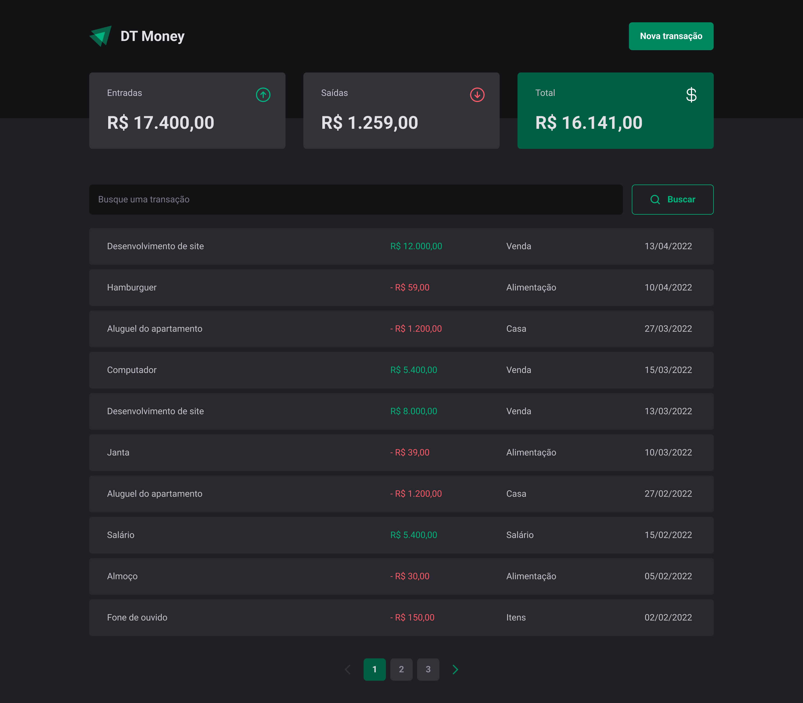

# DT-Money

This web application allow user to save and query financial transactions, including expenses and revenues. The front-end is built using React, while the back-end is being simulated using an API that communicates with a json-server.

## Screenshots

Here are some screenshots of the project:

    
Click to view images

    <h2>Home</h2>
    
    <h2 style="margin-top: 50px">Transaction</h2>
    

## Technologies Used

- **React**: A JavaScript library for building user interfaces.
- **React-DOM**: A package for rendering React components in the browser.
- **React-Hook-Form**: A library for building forms in React using hooks.
- **styled-components**: A library for styling React components using CSS-in-JS.
- **axios**: A promise-based HTTP client for the browser and Node.js.
- **API**: An interface that allows the front-end to communicate with the back-end.
- **json-server**: A package for creating a fake REST API for development and testing purposes.
- **TypeScript**: A superset of JavaScript that adds type annotations and other features to the language.
- **eslint**: A tool for identifying and reporting on patterns found in JavaScript code.

## Installation

To run the application, you will need to have Node.js and npm installed on your machine. Then, follow these steps:

1. Clone the repository
2. Install dependencies: `npm install`
3. Start the json-server: `npm run dev:server`
4. Start the development server: `npm run dev`
5. Open the application in your browser in your localhost

## Usage

Once the application is running, you can add new transactions by filling out the form on the home page. You can also view a list of all transactions on the Transactions page.

## Disclaimer

"This project was created as part of the Ignite course by Rocketseat" / [@Rocketseat](https://github.com/Rocketseat)

